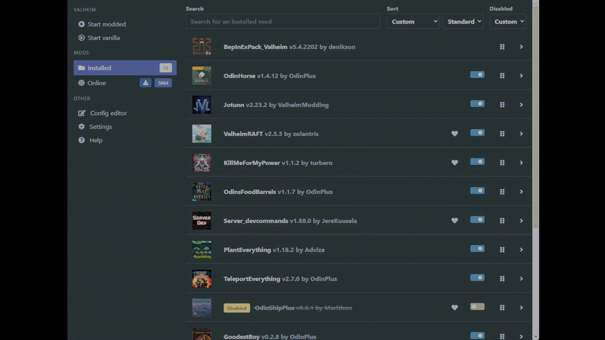

# Getting Started with Mods

Follow these steps to configure and run mods on your Valheim server.

## Step 1: Set the `TYPE` Variable

Set the `TYPE` environment variable to one of the following options:

| Type    | What It Installs                                                                                                                                                           |
| ------- | -------------------------------------------------------------------------------------------------------------------------------------------------------------------------- |
| Vanilla | The default and most common installation type. This will run Valheim normally.                                                                                             |
| BepInEx | Installs [BepInEx from this package](https://valheim.thunderstore.io/package/denikson/BepInExPack_Valheim/). It includes only the minimal components required for BepInEx. |

## Step 2: Configuring Mods

If you do not wish to install additional mods, you can skip this step. Otherwise, use the `MODS` environment variable to specify the mods you want to add. There are two options:

### Option A: Using R2ModMan's Mod List Feature

1. In R2ModMan, click **Settings**.
2. Click **Mod Packs**.
3. Click **Show Dependency Strings**.
4. Copy everything except the BepInEx dependency (this will be installed via `TYPE`).



Example configuration:

```yaml
version: "3"
services:
  valheim:
    image: mbround18/valheim:latest
    environment:
      # The TYPE variable sets the server type.
      - TYPE=BepInEx
      # The MODS variable is a newline-separated list of mods.
      - |
        MODS=OdinPlus-OdinHorse-1.4.12
        ValheimModding-Jotunn-2.23.2
        zolantris-ValheimRAFT-2.5.3
        turbero-KillMeForMyPower-1.1.2
```

### Option B: Using Mod URLs

Specify mods by providing their URLs. Ensure that each URL is followed by a newline to be valid.

Example configuration:

```yaml
version: "3"
services:
  valheim:
    image: mbround18/valheim:latest
    environment:
      # The TYPE variable sets the server type.
      - TYPE=BepInEx
      # The MODS variable is a comma and newline separated list of mod URLs.
      # Each mod URL must end with a newline.
      - "MODS=
        https://cdn.thunderstore.io/live/repository/packages/abearcodes-SimpleRecycling-0.0.10.zip,
        https://cdn.thunderstore.io/live/repository/packages/abearcodes-CraftingWithContainers-1.0.9.zip
        "
```

## Step 3: Run Docker Compose

Once your configuration is set up, start your server by running:

```bash
docker-compose up
```

> **Note:** Odin automatically detects if you are running with BepInEx and adjusts the environment variables accordingly.
>
> **DISCLAIMER:** Modding your server can cause unexpected errors.
>
> - **Do not** open an issue on the `valheim-docker` repository for mod-related problems.
> - By installing mods, you agree to perform a root cause analysis on any server failures before reporting them.
> - Modding is currently unsupported by the Valheim developers and receives only limited support from the `valheim-docker` repository.
> - If you encounter issues, please contact the mod developer first, referring to the output logs for details.

## Additional Help with Valheim Updates

Mod development can be slow, and having many mods installed may complicate updates. It is recommended that you:

- Disable the `AUTO_UPDATE` variable when using mods.
- Refrain from updating your local client until all your mods have been updated.

Some mods may break with new Valheim updates, while others will not. Stay vigilant for mod-related issues when updating your server.

---
