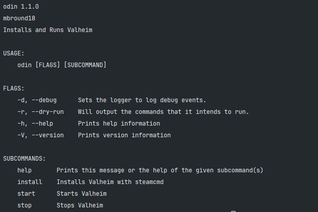

# Odin

Odin is a CLI tool utilized for installing, starting, and stopping [Valheim] servers

> [Who is odin?](https://en.wikipedia.org/wiki/Odin)

## Odin Specific Environment Variables

> These are set automatically by Odin;
> you DO NOT need to set these and only mess with them if you Know what you are doing.

| Variable         | Default       | Required | Description                                                                                                                |
| ---------------- | ------------- | -------- | -------------------------------------------------------------------------------------------------------------------------- |
| DEBUG_MODE       | `0`           | FALSE    | Set to `1` if you want a noisy output and to see what Odin is doing.                                                       |
| ODIN_CONFIG_FILE | `config.json` | FALSE    | This file stores start parameters to restart the instance, change if you run multiple container instances on the same host |
| ODIN_WORKING_DIR | `$PWD`        | FALSE    | Sets the directory you wish to run `odin` commands in and can be used to set where valheim is managed from.                |

## Gotchas

- Odin relies on Rust. [Please install Rust](https://www.rust-lang.org/tools/install)
- Odin also assumes that you have SteamCMD already installed. [Install instructions for SteamCMD.](https://developer.valvesoftware.com/wiki/SteamCMD)
- If you have the proper build tools installed you should be able to run Odin on any system.
- Current Supported Architecture: Unix & Linux based systems.

## Setup

> Make sure you have build essentials installed before you install this crate

1. Install Rust & git
2. Clone the repo
3. `cargo install cargo-make`
4. `makers -e production release`
5. `chmod +x ./target/debug/odin`
6. Copy `./target/debug/odin` to `/usr/local/bin`

## Usage



### Install Valheim

```sh
odin install
```


### Start Valheim

```sh
odin start
```


### Stop Valheim

```sh
odin stop
```


### Status

#### Local Server

```sh
odin status
```

#### Remote Server

Replace the `xx.xx.xx.xx` with your server IP and `query-port` with the `PORT` variable +1 (ex: if `2456` use `2457` which is the steam query port.)

```shell
odin status --address "xx.xx.xx.xx:query-port"
```

## Systemd service

1. With the root user or using sudo run

   ```shell
   nano /etc/systemd/system/valheim.service
   ```

2. Copy and paste the text below

   ```toml
   [Unit]
   Description=Valheim Server
   After=network.target
   StartLimitIntervalSec=0

   [Service]
   Type=simple
   Restart=always
   RestartSec=1
   User=steam
   Environment="PORT=2456" 'NAME="Valheim Docker"' "WORLD=Dedicated" "PUBLIC=1" "PASSWORD=changeme"
   WorkingDirectory=/home/steam/valheim
   ExecStartPre=/usr/bin/env /usr/local/bin/odin configure
   ExecStart=/usr/bin/env /usr/local/bin/odin start
   ExecStop=/usr/bin/env /usr/local/bin/odin stop

   [Install]
   WantedBy=multi-user.target
   ```

3. Make any necessary changes to the service to fit your needs.
4. Next save the file and start the service.

   ```shell
   sudo systemctl start valheim
   ```

5. To have the server start on server launch, run:

   ```shell
   sudo systemctl enable valheim
   ```
